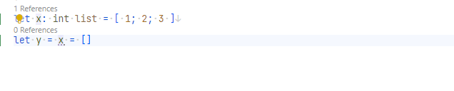

# ListEqualsEmptyListAnalyzer

## Problem

It is less performant to check if a list is empty by using the `=` operator.

```fsharp
let a = [ 1; 2; 3 ]
// Analyzer will trigger
let b = [] = a
```

## Fix

```fsharp
let b = List.isEmpty will check if there is no tail which is faster than the equality check.
```

## Code fix

This analyzer has a code fix for Ionide:

