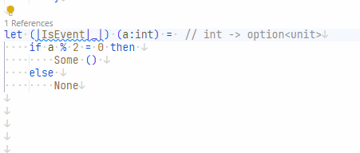

# ReturnStructPartialActivePatternAnalyzer

## Problem

Since F# 6.0 you can use [struct representations for partial active patterns](https://learn.microsoft.com/en-us/dotnet/fsharp/whats-new/fsharp-6#struct-representations-for-partial-active-patterns).  
The net result is that allocations are reduced. Whether you really want this will depend on your own code.

```fsharp
// Analyzer will trigger.
let (|Int|_|) str =
   match System.Int32.TryParse(str) with
   | true, int -> Some(int)
   | _ -> None
```

## Fix

```fsharp
[<return: Struct>]
let (|Int|_|) str =
   match System.Int32.TryParse(str) with
   | true, int -> ValueSome(int)
   | _ -> ValueNone
```

## Code fix

This analyzer has a code fix for Ionide:


