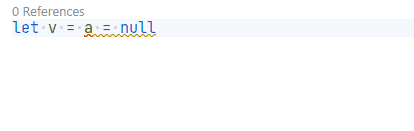

# EqualsNullAnalyzer

Using `=` or `<>` to compare with `null` produces less optimal IL code.

## Problem

```fsharp
let a = obj()
// Analyzer will trigger
a = null
```

## Fix

```fsharp
isNull a
```

## Ignore Comment

You can ignore this analyzer on a line by adding the following comment:

```fsharp
// IGNORE: IONIDE-011
a = null
```

## Code fix

This analyzer has a code fix for Ionide:


