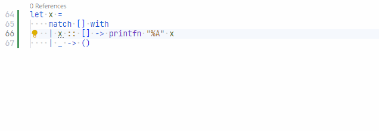

# HeadConsEmptyListPatternAnalyzer

## Problem
Using the cons pattern (`::`) with an empty list does not make much sense.

```fsharp
match [] with
// Triggers analyzer
| x :: [] -> ()
| _ -> ()
```

## Fix

Check for a pattern with a single item in the list instead.

```fsharp
match [] with
| [ x ] -> ()
| _ -> ()
```


## Code fix

This analyzer has a code fix for Ionide:

