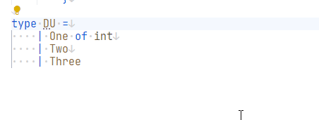

# StructDiscriminatedUnionAnalyzer

When a Discriminated Union only has primitive(-ish) field data you can consider to turn it into a struct.

## Problem

```fsharp
type DU =
    | One
    | Two of a:int
    | Three of b:float
```

## Fix

```fsharp
[<Struct>]
type DU =
    | One
    | Two of a:int
    | Three of b:float
```

## Code fix

This analyzer has a code fix for Ionide:


